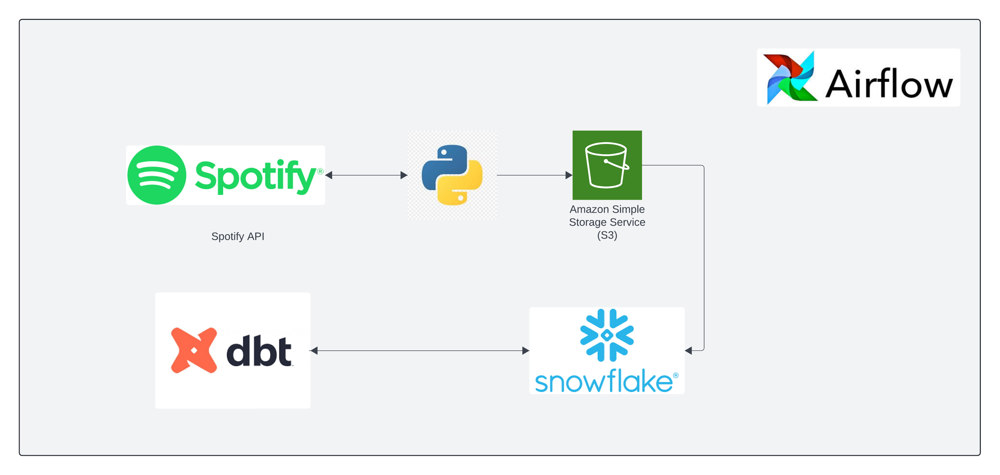
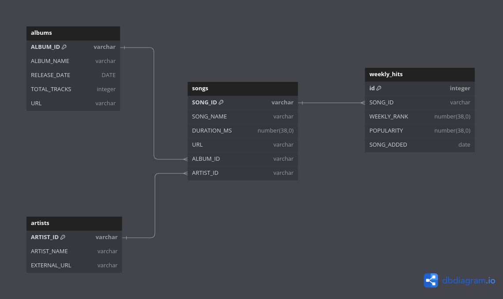

# Data Pipeline: Spotify ELT to Snowflake Data Warehouse

This data pipeline leverages an ELT (Extract, Load, Transform) approach to automate the process of extracting JSON data from the Spotify API, loading it into a Snowflake data warehouse, and then transforming it within the warehouse.

### Description:

The pipeline utilizes airflow to orchestrate the workflow:

- Schedules a weekly python job to extrat the data

- Loads the raw data directly into Snowflake using snowflake operator.

- Transforms the data within Snowflake using dbt operator.

### Running the Pipeline:

- Airflow triggers the python operator which extracts data from spotify API 

- Extracted data is stored into S3

- snowflake operator of the airflow transfers the file from s3 to snowflake 

- dbt operator of the airflow runs the transformation process within snowflake

- The transformed data is then available in the snowflake data warehouse for analysis and reporting.

## **Data Model:**

The Snowflake data warehouse uses a relational data model with the following tables:

**songs:**

| Column Name | Data Type | Description |
|---|---|---|
| SONG_ID | varchar (primary key) | Unique identifier for each song |
| SONG_NAME | varchar | Name of the song |
| DURATION_MS | number(38,0) | Duration of the song in milliseconds |
| URL | varchar | Web address of the song |
| ALBUM_ID | varchar | Foreign key referencing the albums table |
| ARTIST_ID | varchar | Foreign key referencing the artists table |

**artists:**

| Column Name | Data Type | Description |
|---|---|---|
| ARTIST_ID | varchar (primary key) | Unique identifier for each artist |
| ARTIST_NAME | varchar | Name of the artist |
| EXTERNAL_URL | varchar | Web address associated with the artist |

**albums:**

| Column Name | Data Type | Description |
|---|---|---|
| ALBUM_ID | varchar (primary key) | Unique identifier for each album |
| ALBUM_NAME | varchar | Name of the album |
| RELEASE_DATE | DATE | Date the album was released |
| TOTAL_TRACKS | integer | Number of tracks on the album |
| URL | varchar | Web address of the album |

**weekly_hits:**

| Column Name | Data Type | Description |
|---|---|---|
| id | integer (primary key) | Unique identifier for each entry |
| SONG_ID | varchar | Foreign key referencing the songs table |
| WEEKLY_RANK | number | Rank of the song for that week |
| POPULARITY | number | Song popularity score |
| SONG_ADDED | date | date when the song was added to the weekly list |

   

## **Future Enhancement**

 &#9744; Adding CI/CD       
 &#9744;  Creating presentation layer     
 &#9744;   Visualizing data using BI tool like Looker or Power BI      

